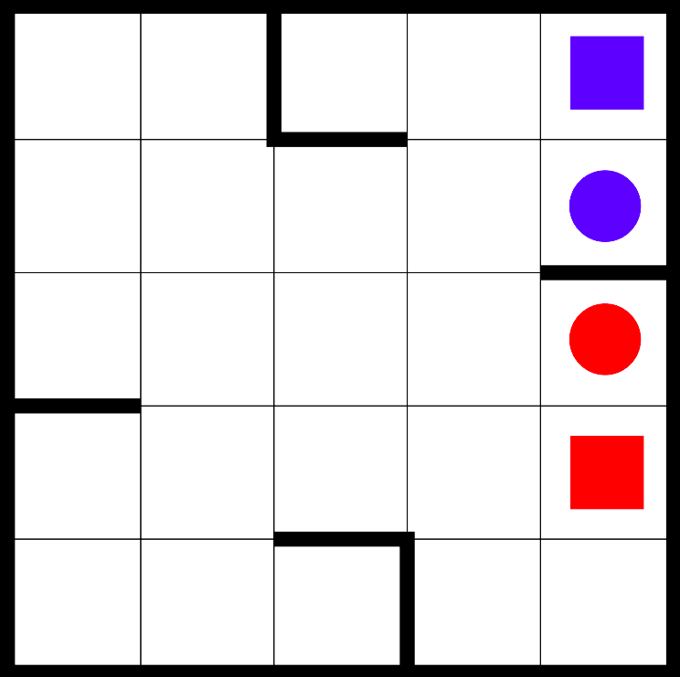

Homework-project
============================

Az ábrán látható táblára egy piros és egy kék golyót helyeztük. A táblát
meg lehet dönteni mind a négy oldala mentén, így a golyók elmozdulhatnak, és
természetes módon addig mozognak, amíg az ábrán vastaggal jelölt
falaknak nem ütköznek. A kék golyót a kék négyzettel, a pirosat pedig a
piros négyzettel jelölt mezőre kell eljuttatni. Csak akkor lehet a táblát adott
irányba megdönteni, ha elmozdulás közben a golyók nem ütköznek össze.

